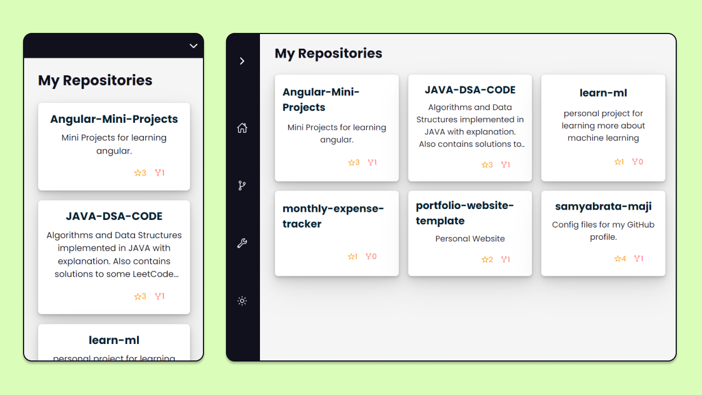

# Personal Website

**Working on a new UI**

Checkout [Live Preview](https://sammaji.pages.dev)

## Preview




## Getting Started

First clone this project. You can also fork this project and then clone.

```
git clone "https://github.com/samyabrata-maji/sammaji.github.io.git"
```

Make sure you have node installed. If not check out [how to install node js](https://docs.npmjs.com/downloading-and-installing-node-js-and-npm)

Now install all required node modules by running the following command:

```
npm install
```
To start the application in **development mode**, run:
```
npm start
OR
npm run start
```

To create a **production build**, run:
```
npm run build
serve -s build
```

## Customize Website

To add your own repository, go to `src/user.js` and add your github username.

```javascript
const USERNAME = {
  github: "samyabrata-maji", // <-- add your github username here
  twitter: "sammaji15", // <-- add your twitter username here and so on...
  linkedin: "samyabrata-maji",
};
```

You can also customize some properties in `user.js`. For example, to include forked repositories, just include `showForkedRepos: true` in `settings`

```javascript
const settings = {
  showForkedRepos: true,
};
```

To hide forks count, just add `showForksCount: false`

```javascript
const settings = {
  showStarsCount: false,
  showForksCount: false,
  showForkedRepos: true,
};
```
